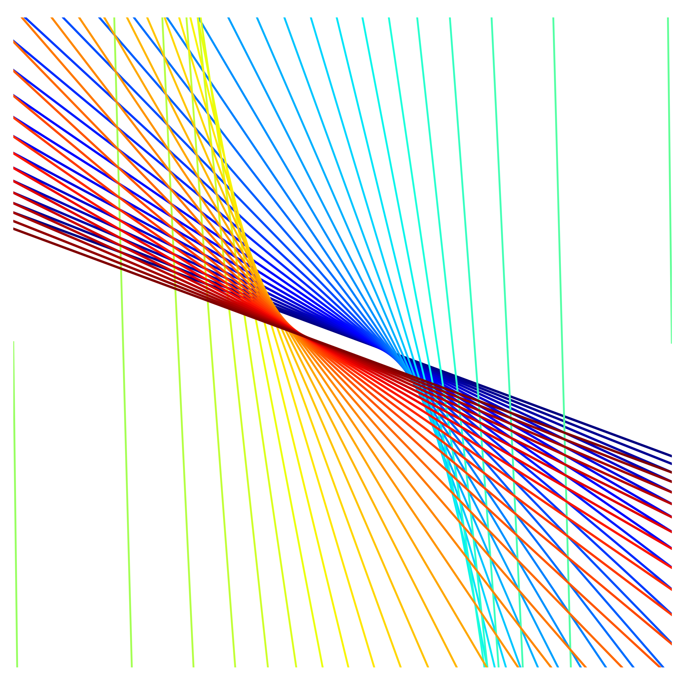

---

# MA5P1 Dissertation Code

Code used in the _On Sets Defining Few Ordinary Lines_ dissertation at the University of Warwick (2018).

This includes plotting points over various line assortments.

For example:

    

